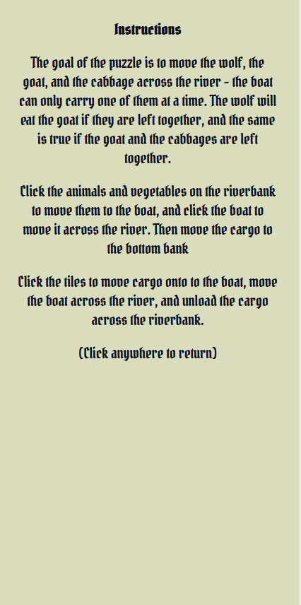
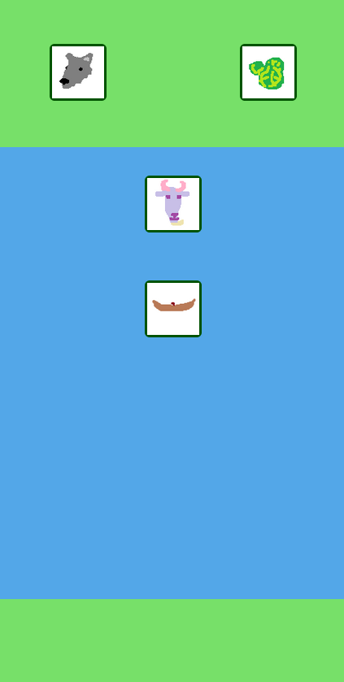
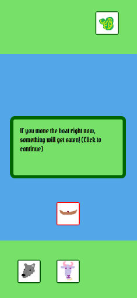
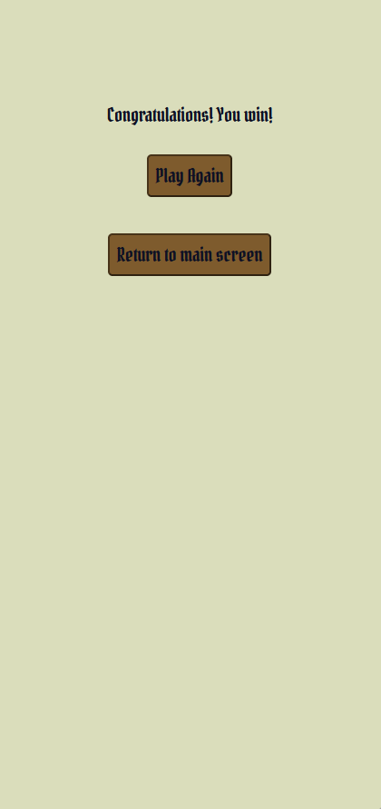
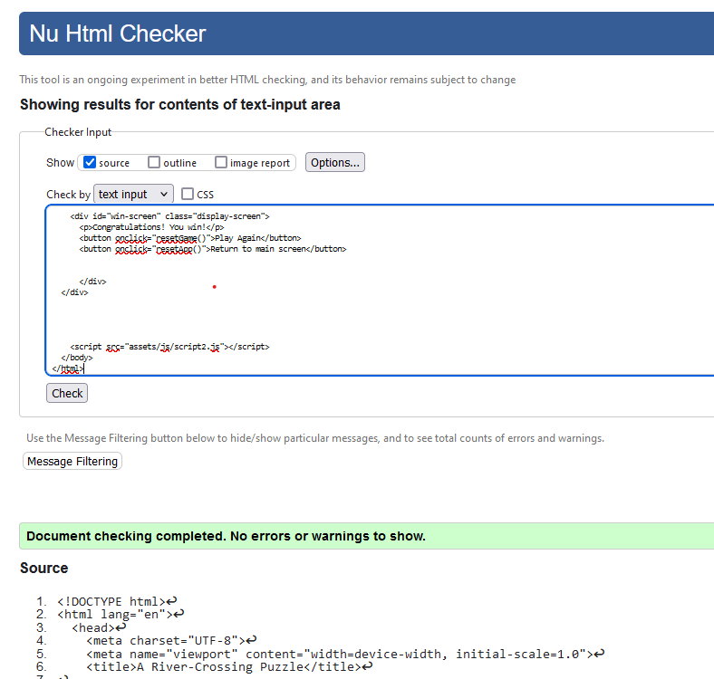
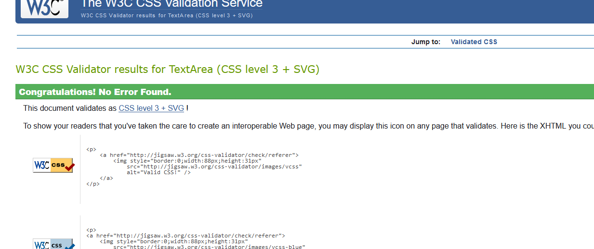

# The Wolf, Goat, Cabbage Problem

The Wolf, Goat, Cabbage Problem is an old riddle that has elements of logic to it. The purpose of this application is to make a playable version of the riddle available. It is intended for people interested in seeing how the problem works as part of an interest in history or logic, and also for those who just want to play it for its own sake as a diversion. It's primarily designed for mobile browser but is also playable on desktop.

## Features

### Start screen

Before the game begins, there's a start screen that helps orient the user. It provides an introduction to the riddle, and buttons allow the user to look at an instruction screen or go directly to the game. The font was chosen for its medieval look, and the background colour was chosen to be suggestive of an old book or parchment.

### Instructions

The instructions are presented on a screen of their own to avoid overloading the user.

### Main Puzzle Screen

The main puzzle screen is a representation of two river banks (in green) and a river (in blue), with "tiles" representing a wolf, goat, and cabbages, and a boat. The animals and vegatables start on one side of the river and the goal is to get them to the other side, with the constraint that the wolf and goat can't be left together, and the cabbages and goat can't be left together. The tiles are clickable, which moves them to different locations.

The below screenshots show different configurations of the tiles:

### Invalid moves

If the boat attempts to move away from a bank while one of the forbidden pairs is on the bank, feedback is given to the user in the following ways:

- a popup message
- the boat's border turns red
- the boat's border shakes

### Win screen

When all the tiles are on the bottom bank, feedback is provided by having the tiles expand and contract, and then after a couple of seconds a win screen is displayed. The win screen has buttons to allow the user to restart.

# Testing

## Validation

Html and CSS code passed validation:

Javascript passed through JSLinter and all warnings were to do with code not being available on older versions, which is acceptable for our product: [Javascript validation results](jshint-results.md)

## Unit testing

The following tests were run:

1. "Correct" playthrough. The steps are:

   1. Goat
   2. Boat
   3. Goat
   4. Boat

   5. Wolf
   6. Boat
   7. Wolf

   8. Goat
   9. Boat
   10. Goat

   11. Cabbages
   12. Boat
   13. Cabbages

   14. Boat
   15. Goat
   16. Boat
   17. Goat

This results in the win screen displaying, so the test passed.

2. Several invalid moves were tried to make sure the warning displayed correctly:

   1. On the top bank, if the wolf is put on the boat and the boat is clicked, the warning displays correctly.
   2. The following steps were tried:
     1. Goat
     2. Boat
     3. Goat
     4. Boat

     5. Cabbages
     6. Boat
     7. Cabbages
     8. Boat

     This leaves the cabbages and the goat alone on the bottom bank, and the warning displays correctly.

3. Clicking each of the buttons and "click to return" screens. All tests passed.

4. Playthroughs were performed in Chrome, Firefox, and Safari and no issues were noted.

5. The game was played through using developer tools to model the application on mobile devices and tablets. No issues were noted.

## Fixed Bugs

* Bug: If the game is played through and then replayed, the animation for the tiles when the game is won didn't work. This was fixed by separating out the functions that switched the animation on and off.
* Bug: errors were appearing in the console, where getElementById was looking for nonexistent png files. This was fixed by adding a conditional statement that made getElementById only look for non-empty tile spaces.

# Deployment

The site was deployed to GitHub pages. The steps to deploy are as follows:

- In the GitHub repository, navigate to the Settings tab
- From the source section drop-down menu, select the Master Branch
- Once the master branch has been selected, the page will be automatically refreshed with a detailed ribbon display to indicate the successful deployment.

The live link can be found at [https://tenthweb.github.io/wolf-goat-cabbages-puzzle/game.html](https://tenthweb.github.io/wolf-goat-cabbages-puzzle/game.html).

# Credits

## Content

- General directions for the project came out of discussions with friends and with my mentor, Victor Miclovich.
- Timer function was taken from w3schools [here](https://www.w3schools.com/jsref/met_win_settimeout.asp)
- The syntax for using onClick with buttons was adapted from [w3schools](https://www.w3schools.com/jsref/event_onclick.aspw3schools)
- The shaking animation was based on [this page](https://unused-css.com/blog/css-shake-animation/)
- The animation for the tiles when the win-conditions are met is adapted from [this site](https://animania.info/css/grow-shrink).
- The favicon was generated [here](https://favicon.io/favicon-converter/)
- The freezeTiles function was based on [this question on stackoverflow](https://stackoverflow.com/questions/18083061/make-element-unclickable-click-things-behind-it)

## Media

Images were made by me, but future versions may use different images.

Fonts are from google fonts.
